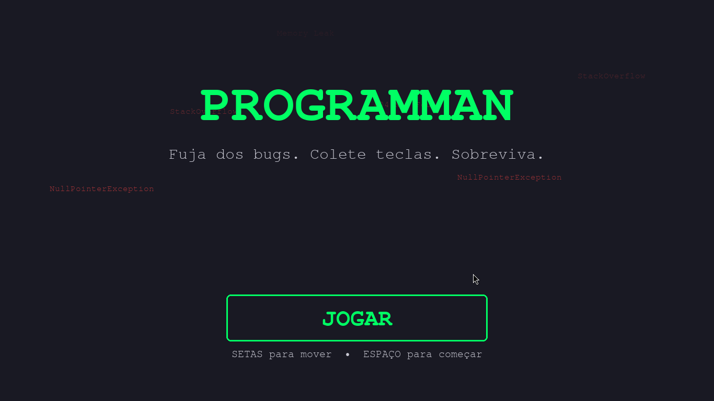
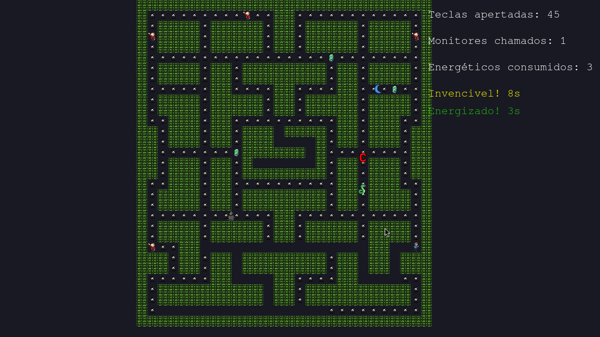
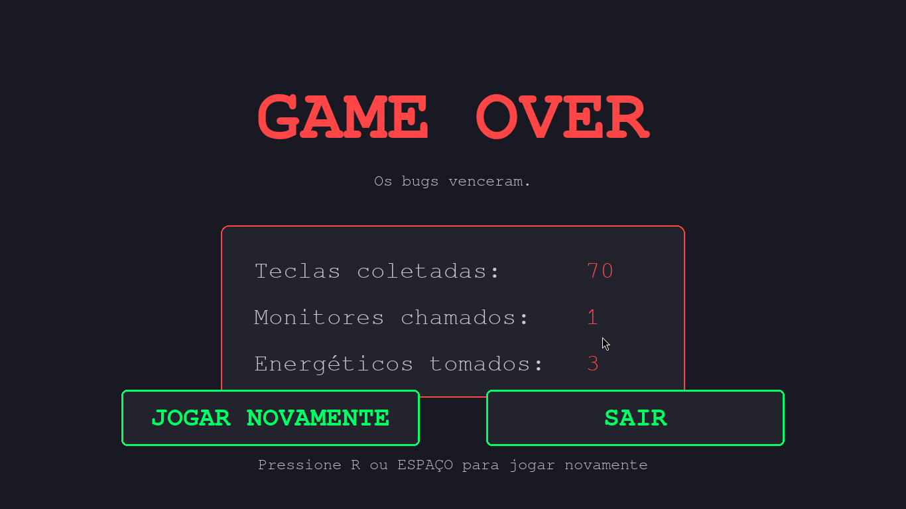

# ProgramMan

> Um projeto de jogo arcade em **Python + Pygame**, inspirado em Pac-Man, com foco em arquitetura modular e fácil expansão.






## Sobre o projeto

O **ProgramMan** é um protótipo de jogo 2D desenvolvido em Python utilizando a biblioteca **Pygame**. O objetivo do projeto é estudar e praticar conceitos de:

* Arquitetura de jogos
* Programação orientada a objetos
* Organização de código em módulos
* Manipulação de sprites, mapas e colisões

O jogo utiliza um labirinto em grade (tile-based), com jogador, paredes e pellets, permitindo evolução futura para inimigos, pontuação, vidas e IA.

---

## Arquitetura do código

A arquitetura do projeto é **modular**, separando claramente responsabilidades. Isso facilita manutenção, testes e adição de novas funcionalidades.

### Estrutura geral

```
ProgramMan/
├─ codigo/            # Codigo do jogo (main, lógica, entidades, mapa, etc.)
├─ imagens/           # Sprites, tiles e outros assets gráficos
└─ .gitignore
```

### Organização do codigo

**1. Entidades do jogo (Sprites)**
As entidades principais (jogador, paredes, pellets, inimigos) herdam de `pygame.sprite.Sprite`. Isso permite:

* Uso de `Group` para atualização e renderização
* Colisões eficientes com `spritecollide`
* Organização clara do ciclo de vida dos objetos

Exemplos de responsabilidades:

* Jogador: movimento, entrada do usuário, colisões
* Parede: obstáculo estático
* Pellet: item coletável

**2. Mapa / Labirinto**
O labirinto é construído a partir de uma representação em grade (tiles). Cada caractere ou valor do mapa gera uma entidade correspondente.

Benefícios dessa abordagem:

* Fácil criação de novos mapas
* Separação entre lógica e layout
* Escalável para múltiplos níveis

**3. Loop principal do jogo (Main.py)**
O loop principal segue o padrão:

1. Processar eventos
2. Atualizar estado do jogo
3. Renderizar na tela

Isso garante:

* Taxa de quadros controlada (`Clock`)
* Atualizações consistentes
* Código previsível e organizado

**4. Assets desacoplados do código**
As imagens ficam na pasta `imagens/`, evitando caminhos absolutos e facilitando a troca de sprites sem alterar a lógica do jogo.

---

## Como executar

### Requisitos

* Python 3.8 ou superior
* Pygame

Instale o Pygame com:

```bash
pip install pygame
```

### Executando

Clone o repositório e execute o script principal:

```bash
git clone https://github.com/v-baumel/ProgramMan.git
cd ProgramMan
python labirinto.py
```

 Controles

* Setas — mover o jogador
* ESC — sair do jogo

---

## Possíveis evoluções

* IA melhor para inimigos (ghosts)
* Sistema de pontuação
* Sistema de vidas 
* Mais animações de sprites
* Sons e música
* Múltiplos níveis

---

Desenvolvido por (...)
